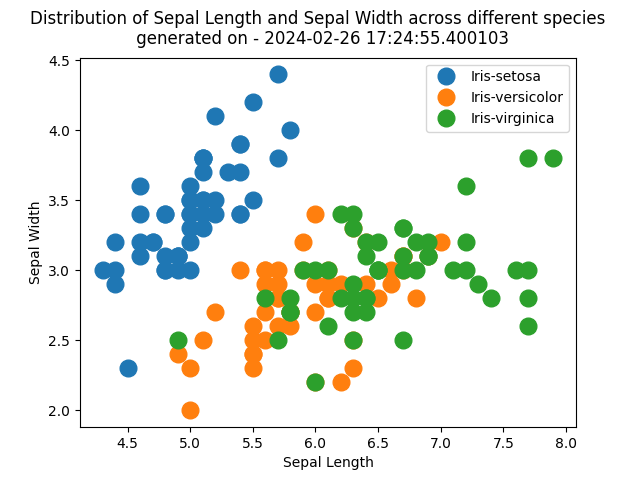

| column name   |   count |    mean |      std |   min |   25% |   50% |   75% |   max |
|:--------------|--------:|--------:|---------:|------:|------:|------:|------:|:-----:|
| sepal_length  |     150 | 5.84333 | 0.828066 |   4.3 |   5.1 |  5.8  |   6.4 |   7.9 |
| sepal_width   |     150 | 3.054   | 0.433594 |   2   |   2.8 |  3    |   3.3 |   4.4 |
| petal_length  |     150 | 3.75867 | 1.76442  |   1   |   1.6 |  4.35 |   5.1 |   6.9 |
| petal_width   |     150 | 1.19867 | 0.763161 |   0.1 |   0.3 |  1.3  |   1.8 |   2.5 |

Generated at: 2023-09-20 21:09:02.459968

